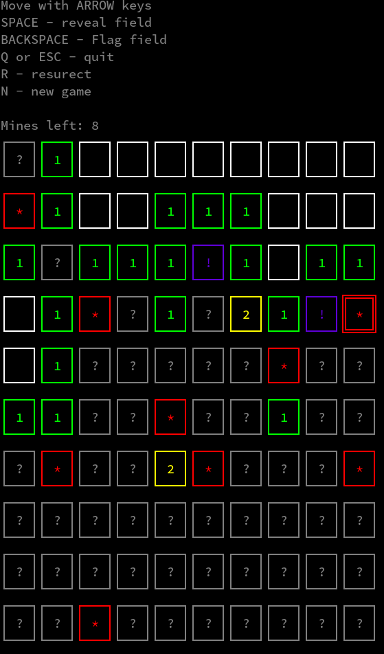

# Sapter

_"Minesweeper is only wrong once"_

Minesweeper written in Rust using [ruscii](https://github.com/lemunozm/ruscii) library.
Written as an exercise while learning Rust.

## Screenshots




## Building

To build you need rustc compiler. Install rust according to instructions given here: https://www.rust-lang.org/learn/get-started
Then run the build:

```sh
> cargo build --release
```

## Running

1. Download a release from Github Releases.
2. Unzip it
3. Execute it in terminal:

```sh
> cd sapter
> ./target/release/sapter
```

## Playing

ARROWS - Move  
SPACE - reveal field  
BACKSPACE - Flag field  
Q or ESC - quit  
R - resurect  
N - new game  
